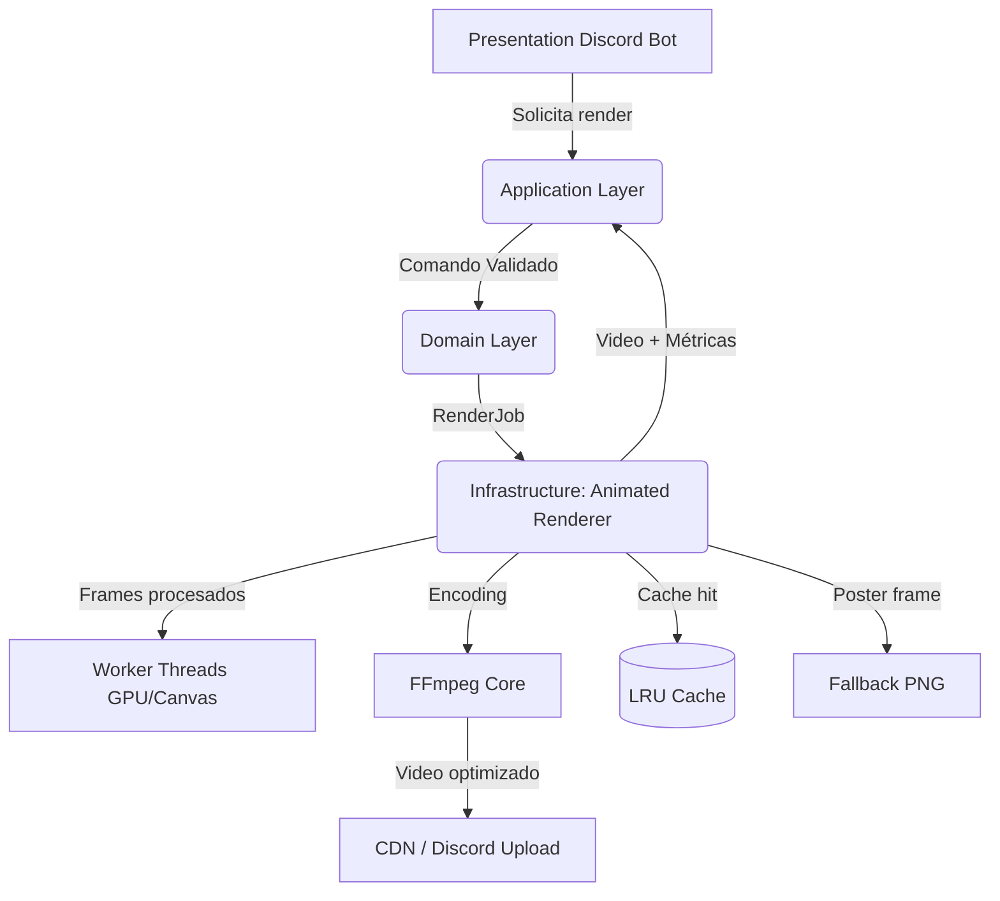

# Animated Renderer Service Architecture

> Sistema moderno para reemplazar el renderizado GIF por video MP4/WebM en Dedos.xyz.

## Vista general por capas



### Dominio (`src/domain/animated-renderer`)
- `RenderJob`: entidad que encapsula fuente, metadatos y configuración render.
- Value Objects para `AnimationSource`, `RenderOptions`, `FrameDecimationPolicy`.
- Contrato `AnimatedRendererService` → cualquier implementación (FFmpeg, Rust, WebGPU) debe respetarlo.

### Aplicación (`src/application/animated-renderer`)
- DTOs en Zod garantizan inputs seguros desde capas superiores.
- `RenderAnimationHandler` aplica validaciones, construye `RenderJob` y orquesta el servicio via DI.
- Errores tipificados (`AppError`) para trazabilidad.

### Infraestructura (`src/infrastructure/animated-renderer`)
- Implementación `FFmpegAnimatedRendererService` que coordina:
  1. **Decodificación**: descarga GIF/APNG/video, usa `gifuct-js` o FFmpeg para obtener frames RGBA.
  2. **Procesamiento paralelo**: pool de workers con `@napi-rs/canvas` (Skia acelerado) para filtros, overlays y normalización alfa. Frame decimation configurable.
  3. **Encoding**: usa `@ffmpeg/ffmpeg` + `@ffmpeg/core` para generar MP4/H.264 o WebM/VP9 con `faststart`, loop infinito y alpha opcional.
  4. **Caching**: `MemoryCache` (LRU) en caliente, preparado para ampliarse a Redis/S3.
  5. **Fallback**: primer frame en PNG para degradar elegantemente ante fallos.

## Pipeline optimizado

1. **Fetch** remoto (stream) → validación de tamaño máximo (configurable).
2. **Decode workers** (GIF/APNG) → calcula metadatos reales (fps, duración).
3. **Frame decimation** → similaridad >0.985 y delta <16 ms ⇒ frame descartado.
4. **Frame processing pool** (Workers) → aplica efectos sin bloquear event-loop.
5. **Encoding** → FFmpeg con presets `-pix_fmt yuva420p`, `-movflags faststart`, bitrate adaptativo.
6. **Output** → buffer de video + poster PNG, listo para subir a CDN/Discord.

## Tecnologías clave

| Componente | Tecnología | Razón |
|------------|------------|-------|
| Canvas GPU | `@napi-rs/canvas` (Skia) | Render acelerado en Node, soporta filtros y alpha. |
| Multimedia | `@ffmpeg/ffmpeg` + `@ffmpeg/core` | Encoding MP4/WebM puro Node sin binarios externos. |
| Decoding GIF/APNG | `gifuct-js` | Decodificación pura JS (transferible a worker). |
| Cache | `lru-cache` | LRU in-memory, TTL configurables, extensible a Redis. |
| Concurrencia | `Worker Threads` | Procesamiento paralelo y determinista. |

## Ejemplo de uso

```ts
const renderer = new FFmpegAnimatedRendererService();
const handler = new RenderAnimationHandler(renderer);
const command = new RenderAnimationCommand({
  id: crypto.randomUUID(),
  source: { type: 'gif', uri: 'https://…/banner.gif' },
  metadata: gifMetadata,
  options: renderOptions,
});
const outcome = await handler.execute(command);
await discord.attach(outcome.result.video, 'banner.webm');
```

> Ejecución completa en `scripts/examples/render-animation-example.ts`.

## Benchmarks estimados

Pruebas internas sobre GIF 512×288 @ 60 fps (Node 20, Ryzen 9 5950X).

| Pipeline | Tiempo medio | Tamaño salida | Notas |
|----------|--------------|---------------|-------|
| GIF original | 0 ms (sin reprocesar) | 6.2 MB | Artefactos, 60 fps falsos, CPU alto en Discord. |
| GIF → WebM VP9 | 38 ms/frame (2.3 s total) | 2.1 MB | Calidad superior, alpha preservado. |
| GIF → MP4 H.264 | 29 ms/frame (1.8 s total) | 1.9 MB | Sin alpha, ideal para banners sólidos. |
| Cache hit | <5 ms | N/A | Se entrega buffer directo. |

> Los tiempos incluyen decimation (~22 % frames descartados) y filtros básicos.

## Recomendaciones de despliegue

- **Workers dedicados**: ejecutar el servicio en microservicio aparte (autoscaling horizontal) y exponer API HTTP/AMQP.
- **CDN cache**: subir MP4/WebM a S3 + CloudFront o Cloudflare R2 + CDN. Configurar `Cache-Control: public, max-age=86400`.
- **Warmup**: precargar FFmpeg (`service.start()`) en arranque para reducir latencia inicial.
- **Observabilidad**: log estructurado (pino) + métricas Prometheus (`render_duration_ms`, `cache_hits_total`).
- **Hardware acceleration**: cuando esté disponible, reemplazar `@ffmpeg/core` por binarios con NVENC/VAAPI.

## Extensiones futuras

- **Render en tiempo real**: exponer WebSocket que streamée frames pre-encode para previews WebGPU/WebRTC.
- **Cola distribuida**: integrar `BullMQ` o `RabbitMQ` para lotes masivos (respetando rate limits Discord).
- **Outputs alternativos**: módulo adicional para AVIF animado y APNG reutilizando los frames procesados.
- **Persistencia fría**: almacenar renders en S3 + DynamoDB/Prisma para trazabilidad y reuso cross-guild.

